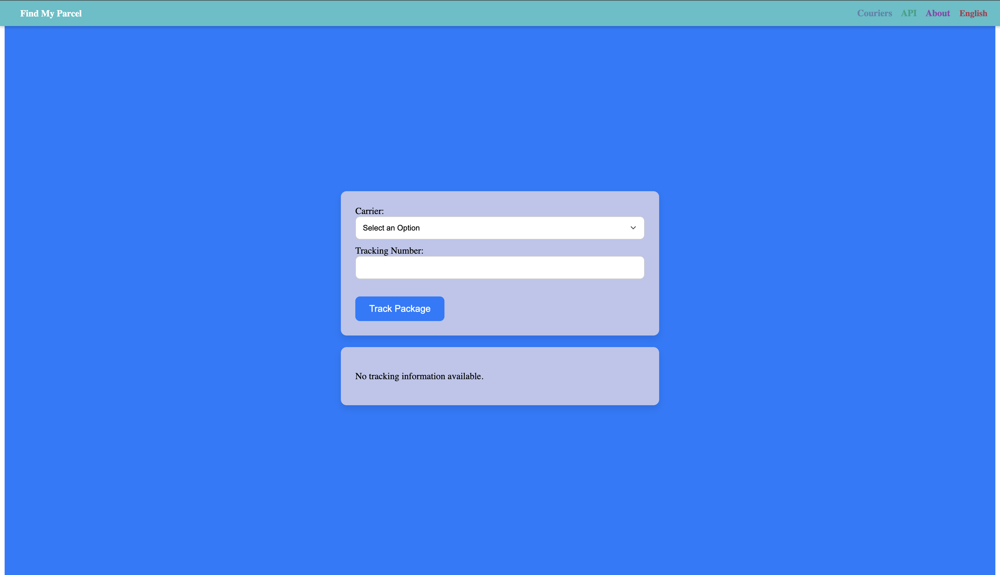

# FindMyParcel

Welcome to **FindMyParcel**, a comprehensive package tracking platform designed to simplify logistics and make courier services more accessible. Utilizing the powerful AfterShip API, this site provides real-time tracking capabilities for a wide array of couriers globally.

## Features

- **Track Packages:** Easily enter your tracking number and get up-to-date information on the location and status of your delivery.
- **Support for Multiple Couriers:** Our platform supports most major courier services, making it your one-stop-shop for package tracking.
- **User-Friendly Interface:** The site is designed with user experience at the forefront, ensuring you can find what you need quickly and without hassle.

## How It Works

1. Visit the homepage.
2. Enter your package's tracking number.
3. Instantly receive updates about your package's current status and location.

## Getting Started

To start using FindMyParcel, simply head to [FindMyParcel.co](https://findmyparcel.co) and enter your tracking number in the provided field.

## API Reference

This site is powered by the AfterShip API, which provides detailed tracking information from various couriers. To learn more about AfterShip and its capabilities, visit [AfterShip's Documentation](https://www.aftership.com/docs/api/).

## Contributing

Contributions to enhance FindMyParcel are always welcome. Whether it's improving the interface, adding new features, or enhancing existing functionality, please feel free to fork the repository and submit a pull request.

## License

This project is licensed under the MIT License - see the [LICENSE.md](LICENSE.md) file for details.
